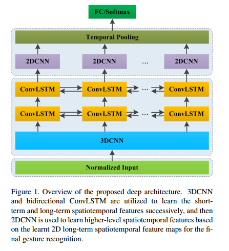
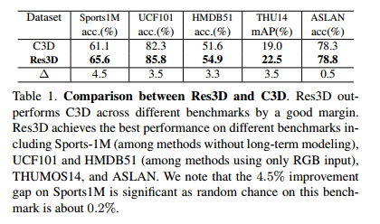

# Attention in Convolutional LSTM for Gesture Recognition(2018)
论文核心：在ConvLSTM基础上加上注意力机制来进行研究。

 

# Learning Spatiotemporal Features with 3D Convolutional Networks(2017)
思路:手势识别通常基于视频或图像序列–>时间信息在手势识别过程中起着关键作用–>复杂的背景会给手势识别带来更多挑战–>同时同步学习时空特征将为手势识别提供更多信息。

首先，利用3D CNN从输入视频中提取短时空特征。然后利用conv LSTM进一步学习长时空特征。最后，用SPP来规范最终分类的时空特征。

 

## 3DCNN
参考论文《learning spatiotemporal features with 3D convolutional networks》(2015,facebook实验室)

 

## ConvLSTM
 

## SPP
空间金字塔池SPP插入ConvLSTM和全连接（FC）层之间以降低维度

 

# Learning Spatiotemporal Features Using 3DCNN and Convolutional LSTM for Gesture Recognition(2017)
- 使用3DCNN和bidirectional conv LSTM学习到2D时空特征信息，2D时空信息可以编码全局时间信息和局部空间信息。时空相关性可以在整个学习过程中被保留；
- 提出的深度网络可以把视频转为2D时空特征信息；
- 提出的时空特征，通过线性SVM输出，在两个不同的benchmark上得到了最好的结果

 

 

# ResNet 残差网络
## Deep Residual Learning for Image Recognition(2015)
 

此文章研究思路为：在图像识别领域，神经网络的深度至关重要——> 但是层数越深，准确率反而降低（如下图）——> 提出了残差网络(ResNet)来解决这个问题。

 

 

 

## ConvNet Architecture Search for Spatiotemporal Feature Learning(2017)
 

这篇文章相当于C3D的第二个版本。

 

# MobileNets
The ConvLSTM network does not shrink the spatial size of the feature maps. Thus, the spatiotemporal feature maps still have a relative large spatial size. The top layers of MobileNet, whose inputs have the same spatial size, are further stacked to learn deeper features. 

## MobileNets: Efficient Convolutional Neural Networks for Mobile Vision Applications(2017)
 

本文是 Google 针对手机等嵌入式设备提出的一个小网络模型，叫 MobileNets，主要侧重于简单有效。

MobileNets are based on a streamlined architecture that uses depthwise separable convolutions to build light weight deep neural networks. 

 

MobileNets主要侧重优化延迟,同时生成小型网络。

## Depthwise Sepatable Convolution 深度可分离卷积
 

滤波：在每个通道（channel）上应用一个卷积核。

结合：逐点卷积接着应用1*1卷积把输出和深度卷积结合起来。

 

MobileNet有（1+13*2+1=28）层

 

