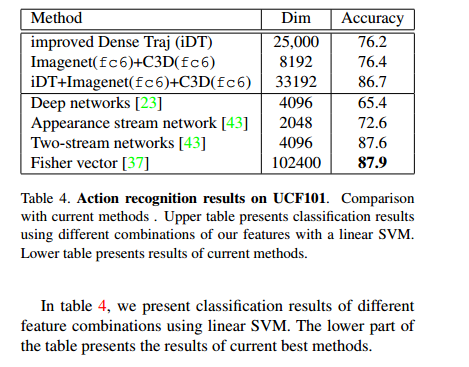

# C3D: Generic Features for Video Analysis
 

# Abstract
there is a lack of generic feature for video analysis. In this work we propose Convolution 3D(C3D) feature, a generic spatio-temporal feature obtained by training a deep 3-dimensional convolutional network on a large annotated video dataset comprising objects, scenes, actions, and other frequently occurring concepts. C3D有三个主要优势。一是共性:实现视频中目标识别、场景分类、动作相似度标注等方面的技术成果。其次，它是紧凑的:获得更好的精度比最好的手工制作的特征和最好的深度图像特征与较低的维特征描述符。第三，它的计算效率:比目前手工制作的功能快91倍，比目前基于深度学习的视频分类方法快两个数量级。

# 1. Introduction
 

generic, compact, efficient.两个困难：首先，没有包含各种通用概念的大规模监督视频数据集;其次，没有有效的方法来学习封装外观和动作的紧凑时空特征.

 

# 2. Related Work
STIPs,HOG,HOF,SIFT,SIFT-3D,HOG3D

 

三维卷积保留了时间信息并将其传递到下一层，而二维卷积则将其完全折叠。

# 3. Learning Spatiotemporal Features
## 3.1 Dataset Design
 

## 3.2 Learning Spatiotemporal Features with 3DConvolutional Neural Networks
### Networks operations
图3说明了两个卷积之间的区别，一个图像上应用2D卷积将输出一个图像，多个图像上应用2D卷积(将它们视为不同的通道)也将得到一个输出图像。只有三维卷积保留了输入信号的时间信息。

### Network's architecture
 

### Training
input:3×16×128×128(3 color channels, 16 frames in time and 128 × 128 frames each)

### Concept training results
 

 

# 4. C3D: New Generic Feature for Videos
## Application 1: Action recognition
1. Dataset:UCF101,UCF101: A dataset of 101 human action classes from videos in the wild.13320 videos of 101 human action categories.
2. Classification model:extract 16-frame cliips with a stride 16; use activations of the last four layers:pool5, fc6, fc7, and prob as features; L2-normalized and given as input to a multi-class linear SVM for training models.
3. Baselines:iDT, Imagenet, 2D ConvNets KNet and VGGA.
4. Results:Table 3 presents accuracy of action recognition on UCF101 using linear SVM for all single features.  . In table 4, we present classification results of different feature combinations using linear SVM. The lower part of the table presents the results of current best methods.  

## 4.2 Application 2: Action similarity labeling
1. Dataset:The ASLAN dataset consists of 3631 videos from 432 action classes.
2. Features: sample videos into 16-frame clips with a stride of 8 (overlap of 8 frames). 

# 5. Compactness and Efficiency

