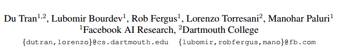
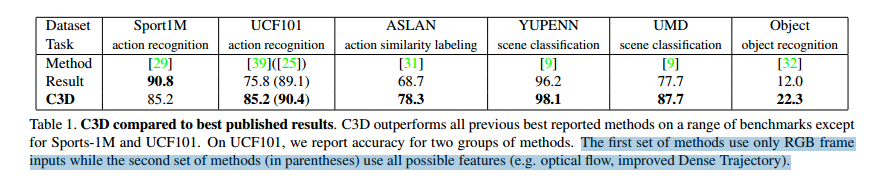
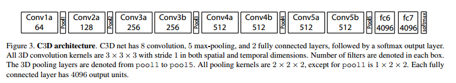
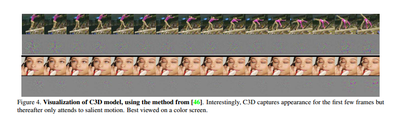

# Learning Spatiotemporal Features with 3D Convolutional Networks
 

三个发现：

1. 3D ConvNets 适合时空特征的学习
2. 3*3*3的卷积核最适合3D ConvNets
3. 我们的C3D是最先进的方法,Table1

四个特征：

1. generic
2. compact
3. efficient
4. simple

 

# Model
当时3×3尺寸的2D卷积核取得了非常好的效果，所以文章就将3D卷积核的高和宽定位3×3，通过实验探索卷积核最优的时间深度。同时作者设计了另一个实验：为了设计能更好地组合时间信息的3D卷积网络，作者改变3D卷积网络中不同层的卷积核的时间深度，实验结果如下：

 

上图是在UCF101上的实验结果，首先看左图，为探索3D卷积核时间深度的实验结果。可以看到作者设置了4种固定尺寸的3D卷积核，分别为1×3×3，3×3×3，5×3×3，7×3×3，实验表明 3×3×3尺寸的卷积核取得了最优的结果。然后看右图，作者设置3种对比的网络结构，不同层的3D卷积核的时间深度分别为时间深度不变： 3−3−3−3−3，时间深度递增：3−3−5−5−7，时间深度递减：7−5−5−3−3。实验结果表明当卷积网络中所有的3D卷积核的时间深度一致，尺寸都为3×3×3时，得到的效果最好。

受到当时GPU显存的限制，作者设计了C3D网络结构，如下图所示：

 

该网络包含8个卷积层，5个池化层，2个全连接层和1个softmax输出层。所有层的3D卷积核的尺寸为 3×3×3,步长为 1×1×1。第一层池化层的尺寸为 1×2×2，步长为 1×2×2，其余池化层的尺寸为 2×2×2，步长为 2×2×2。文章认为不那么过早地池化时间信息，可以在早期阶段保留更多的时间信息。网络的输入的视频长度为16帧，输入的视频帧尺寸为 112×112。

在sports-1M数据集上训练时，首先从每一个视频中随机抽取5个2秒长的视频段，然后视频段的每一帧的尺寸被归一化为 128×17，然后该视频段被随机地裁剪为 16×112×112作为网络的输入。使用了0.5几率随机水平翻转的数据增强的方法，使用随机梯度下降法来优化，batch size设置为30，初始学习率为0.003，每经过150K次迭代学习率除以2，在第1.9M次迭代（大约13个epoch）的时候停止。

我们观察到C3D一开始只关注前几帧的外观，然后在接下来的几帧中跟踪突出的运动。(利用去卷积方法) 

 
文章认为在视频的前几帧，C3D主要关注的是视频帧中的显著性区域，在之后的几帧中会跟踪这些显著变化的区域。其实[3]中也对3D卷积网络的feature map进行了反卷积可视化，可以两个结果对比着看。

所谓的C3D描述子，就是C3D网络第一个全连接层输出的特征经过L2归一化后的结果，文章对该描述子的做了实验，表明该描述子有良好的压缩性和泛化性。

作者使用PCA降维的方法对C3D描述子进行了降维，并与Imagenet特征[4]和iDT特征[5]做了比较，实验结果如下图所示。可以发现C3D描述子还是由很好的压缩性的，这对大规模快速视频检索很有帮助。 

 

动作分类：ASLAN数据集由432个动作类的3,631个视频组成。 任务是预测给定的一对视频对象是否属于相同或不同的动作。 我们将视频分为重叠8帧的16帧片段。 我们提取每个片段的C3D特征：prob，fc7，fc6，pool5。 通过分别平均每种特征类型的片段特征，然后进行L2归一化，来计算视频特征。给出一对视频，我们计算[21]中提供的12个不同的距离。 具有4种特征，我们从每对视频获得48维（12×4 = 48）特征向量。 由于这48个距离彼此无法比较，我们将它们独立地归一化，使得每个维度具有零平均值和单位方差。 最后，训练线性SVM以根据这48维特征向量将视频对归类为相同或不同的。

 
