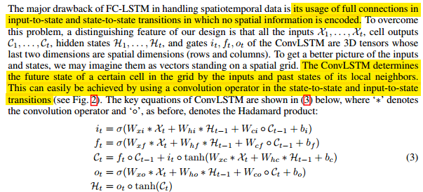

# 基本介绍

 

使用机器学习方进行降水预测，降水预测看做时空序列预测问题，扩展FC-LSTM，提出ConvLSTM，建立端到端可训练模型。

# 1. Introduction

现有的预测方法可分为两类，都存在一些缺点。

降水临近预报实质上是一种时空序列预报问题，输入的是过去的雷达图序列，输出的是未来雷达图的一个固定数值序列(通常大于1)。但是时空序列的高维特性的处理将会是巨大的挑战。使用RENN和LSTM解决该问题。

According to the philosophy underlying the deep learning approach, if we have a reasonable end-to-end model and sufficient data for training it, we are close to solving the problem. 

前人模型中采用的全连通LSTM (FC-LSTM)层没有考虑空间相关性

# 2. Preliminaries

## 2.1 Formulation of Precipitation Nowcasting Problem

From the machine learning perspective, this problem can be regarded as a spatiotemporal sequence forecasting problem.

假设：$M*N$ grid, each cell has P measurements. the observation can be represented by a tensor 

 

 通过把雷达图平铺成不重叠小块，并把小块内的像素视为其度量值。

## 2.2 Long Short-Term Memory for Sequence Modeling

这段将LSTM优缺点全指出来了，以后写论文可能会用到。
 

# 3. The Model

## 3.1 Convolutional LSTM

 

 

FC-LSTM可以看做特殊的ConvLSTM,3D张量的最后两维都是1。

为了保持维度相同，需要使用zero-padding,在输入之前，初始化所有状态都为zero。

## 3.2 Encoding-Forecasting Structure

<<<<<<< HEAD
 

上图包括两个网络: an encoding network and a forecasting network,预测网络的初始状态和单元输出是从编码网络的最后状态复制而来的,The encoding LSTM compresses the whole input sequence into a hidden state tensor and the forecasting LSTM unfolds this hidden state to give the final prediction:

 

这部分和LSTM future predictor model相似(我不清楚)

# Experiments

=======
>>>>>>> 2be1f2c6584a62d7a16ca64161d9ebd57d640504

