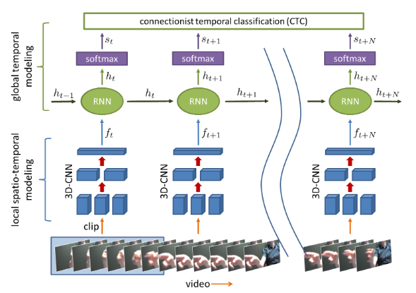

# Abstract
系统必须在线工作，以避免在执行手势及其分类之间出现明显的滞后； 实际上，负延迟（手势完成之前的分类）是可取的，因为对用户的反馈可以是真正的瞬时
我们使用循环三维卷积神经网络应对这些挑战，该网络可以同时从多模态数据中检测动态手势并对其进行分类。
# 1. Introduction
分别考虑手势分割和分类。 通常会分别训练两个分类器，分别是在手势和无手势之间进行区分的检测分类器和识别特定手势类型的识别分类器，并依次应用于输入数据流。
# 2. Related Work
据我们所知，以往的手势识别方法都不能很好地解决这一问题，不能达到设计有效的手势界面所需要的零或负延迟
 

手势视频以short clips的形式呈现给3D-CNN，用于提取局部时空特征。 这些功能输入到循环网络中，该网络汇总了多个片段之间的过渡。 循环网络具有隐藏状态ht-1，该状态是根据先前的剪辑计算得出的。 当前剪辑的更新后的隐藏状态ht被输入到softmax层中以估计各种手势的类条件概率。在训练过程中，CTC用作成本函数
# 3. Method
## 3.1 Network Architecture
我们通过对整个视频进行分割来执行分类，为每个单独的剪辑计算一组类条件概率S = {s0，s1，...，sT-1}。 对于离线手势分类，我们在所有手势类i上平均划分属于预分段手势的所有片段的概率，预测类为y = argmaxi（[i]）。 在线预测不分段的流，我们仅考虑裁剪概率
## 3.2 Training
mini-batch,Weakly-segmented videos
1. Pre-training  the  3D-CNN
C3D
The network has 8 convolutional layers of 3×3×3filters and 2fully-connectedlayers trained on 16-frame clips. We append a softmax prediction layer to the last fully-connected layer 
2. Training the full model
R3DCNN,back-propagation-through-time (BPTT)
3. Connectionist  temporal  classification
在这项工作中应用了CTC，以识别并正确标记手势的核，同时将剩余的手势类分配给其余的片段，从而解决类标签与视频中特定片段的对齐问题
CTC常用在NLP当中，解决的问题是连续训练的时候不好标数据的问题。比如一段”This is a new world”的语音辨识训练样本，往往不能或者代价太大去辨识出具体哪个字母或者音素在什么位置出现或者终结，CTC提供了一种统计方法，只需要给整体进行标注，并不需要对具体的字母进行标注。
动态规划
4. Learning  rule
随机梯度下降
为了防止训练过程中递归层出现梯度爆炸，我们应用了一个软梯度剪切操作
5. Regularization
防止过拟合
Weight decay, drop out, 此外，我们发现在卷积层中删除特征图可以提高预训练网络中的泛化能力。(10%)
6. Implementation

# 4. Dateset
我们捕获了连续的数据流，在室内装有明亮和昏暗人工照明的汽车模拟器中共包含1532个动态手势,20个对象
1050training and482test videos
# 5. Results
## 5.1. Offline Gesture Recognition
- 模态融合:为每种模式训练一个单独的网络，并在融合模式时对它们的类条件概率向量求平均值。The best gesturerecognition accuracy (83.8%) is observed for the combina-tion of all modalities.
- Comparisons:这可能是因为相对于颜色传感器，深度传感器对室内照明的变化更鲁棒，并且更容易排除嘈杂的背景场景
- Design choices
- Recurrent layer as a regularizer for feature extractors:当与SVM分类器结合使用时，来自递归层的功能可以进一步提高性能
## 5.2. Early Detection in Online Operation
### Online operation
R3DCNN  trained  with  negativelog-likelihood (“RNN”) and CTC (“CTC”), respectively—predict  the  correct  class  before  the  gesture ends. However, the network trained with CTC produces significantly fewer false positives.CTC网络会为每个重复生成一个单独的峰，而RNN会将其合并为单个激活。
### Detection
没怎么看懂
## 5.3. Evaluation on Previously Published Datasets
SKIG,ChaLearn 2014
# 6. Conclusion
它支持零延迟或负延迟的在线手势分类，有效的模态融合以及弱分段视频的训练。
